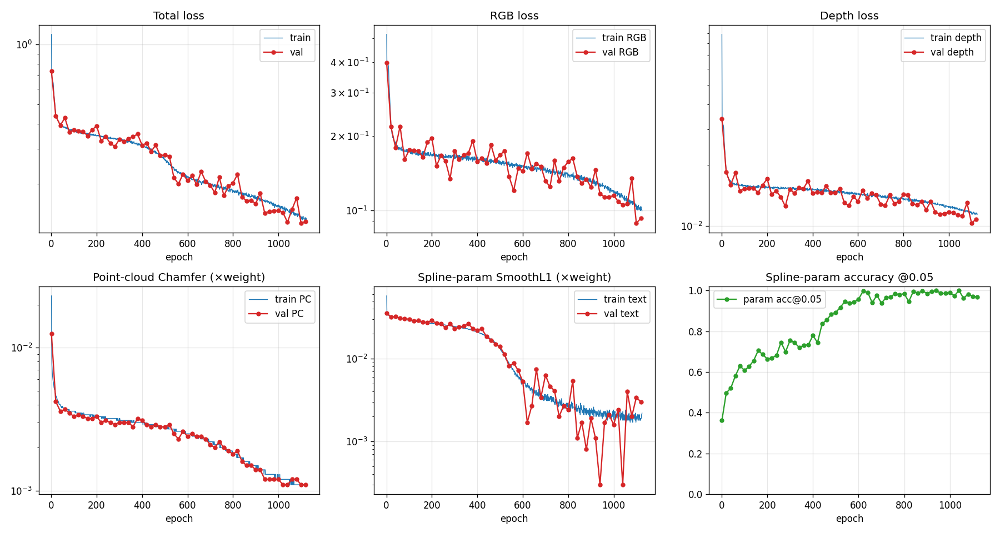

# EmbodiedMAE-4M — Run report: `4m_run_v3`

W&B run name: `Try_with_procedorial_parameters_v3`
W&B URL: https://wandb.ai/yongyun-iowa-state-university/embodied-mae-sorghum/runs/d0lfi27q

## Run status

| Field | Value |
|---|---|
| SLURM Job ID | `10632614` |
| Node | `nova24-gpu-1` (NVIDIA L40S) |
| Started | 2026-05-20 12:33:38 CDT |
| Ended | 2026-05-25 20:15:56 CDT |
| Elapsed | 5d 07h 42m (SLURM walltime cap hit at 8-day limit? — actual: 5d 07h) |
| Final state | `FAILED` (walltime/timeout — last log line is mid-epoch 1125, no Python traceback) |
| Epochs completed | **1125 / 2400** (47%) |
| Best epoch | **1100** (Val loss 0.1268) |
| Last checkpoint on disk | `checkpoints/checkpoint_epoch_1100.pth` (1.37 GB) |
| Best model | `best_model.pth` (1.37 GB, saved at epoch 1100) |

⚠️ **GPU-utilisation anomaly.** `train_4m.sbatch` requested `--gres=gpu:l40s:4`
but the log shows `Launching torchrun with 1 processes` and `🚀 Multi-GPU (torchrun)
GPUs=1  batch/GPU=8  total=8`. The launcher line in the sbatch counts
`${CUDA_VISIBLE_DEVICES}` *without* expanding commas to spaces (the `//,/ ` swap
only fires when the var is unset), so `wc -w` saw `0,1,2,3` as one word →
`NPROC=1`. The run trained on a single L40S instead of four; effective batch
size was 8, not 32. Fix is a 1-character edit to the NPROC line.

## Configuration (effective)

```json
{
    "data_root": "./Dataset/new_data",
    "img_size": 224,
    "num_points": 8196,
    "model_size": "base",
    "mask_ratio": 0.15,
    "pc_loss_weight": 10.0,
    "depth_norm_type": "minmax",
    "spline_loss_weight": 5.0,
    "max_leaves": 24,
    "batch_size": 8,
    "epochs": 2400,
    "lr": 0.00015,
    "weight_decay": 0.05,
    "warmup_epochs": 10,
    "val_freq": 20,
    "save_freq": 100,
    "viz_freq": 50,
    "num_viz_samples": 12,
    "world_size": 1,
    "use_wandb": true
}
```

## Model

- **Architecture:** `EmbodiedMAE-4M-Base` (RGB + Depth + PointCloud + Spline-params)
- **Parameters:** 114,280,716 (~114 M)
- **Encoder:** depth=12, embed_dim=768
- **Decoder:** depth=8, embed_dim=512
- **PC tokens:** 196 (FPS centres, kNN group=32), target points=10 000
- **Text tokens:** 1 plant + 24 leaves = 25 tokens

## Dataset

| Split | Samples | Spline coverage |
|---|---:|---:|
| `Dataset/new_data/train` | 10 000 | 10 000 (100%) |
| `Dataset/new_data/val`   | 100   | 100 (100%) |

## Loss curves



All five loss panels are log-scale. The two big slope changes (~ epoch 520
and ~ epoch 840) are where the spline-param head drops by roughly an order of
magnitude as `acc@0.05` crosses 0.92 and then 0.99 respectively. RGB and PC
keep falling smoothly; depth has a small late-stage plateau around ~0.0085.

## Final / best metrics

### Validation @ best epoch (1100)

| Metric | Value |
|---|---:|
| Val loss (total) | **0.1268** |
| Val RGB (weighted) | 0.0885 |
| Val Depth (weighted) | 0.0103 |
| Val PC (× `pc_loss_weight=10`) | 0.0011 |
| Val Text (× `spline_loss_weight=5`) | 0.0034 |
| RGB MSE (unweighted, per-patch) | 0.6804 |
| Depth MSE (on min-max normalised target) | 0.0085 |
| PC Chamfer (bidirectional, raw) | 0.001100 |
| PC EMD | 0.000000 *(not implemented — logged as 0)* |
| Spline param MSE | 0.014518 |
| Spline param MAE (all leaves) | 0.0488 |
| Spline param MAE (masked tokens only) | 0.0106 |
| Spline param **acc@0.05** | **0.9713** |

### Training (last completed epoch = 1124)

| Loss | Value |
|---|---:|
| Train total | 0.1335 |
| Train RGB | 0.1006 |
| Train Depth | 0.0115 |
| Train PC | 0.0011 |
| Train Text | 0.0021 |

### Per-modality progression at key milestones

| Milestone | Val loss | RGB | Depth | PC Cham | param acc@0.05 |
|---|---:|---:|---:|---:|---:|
| Epoch 1 (warm-up) | 0.7341 | 0.397 | 0.034 | 0.0125 | 0.361 |
| Epoch 100 (end warm-up→cosine) | 0.3738 | 0.175 | 0.015 | 0.0033 | 0.608 |
| Epoch 500 (param head turning on) | 0.2798 | 0.168 | 0.015 | 0.0028 | 0.893 |
| Epoch 800 | 0.2018 | 0.157 | 0.014 | 0.0018 | 0.984 |
| **Epoch 1100 (best)** | **0.1268** | **0.089** | **0.010** | **0.0011** | **0.971** |
| Epoch 1120 (last val) | 0.1293 | 0.093 | 0.011 | 0.0011 | 0.968 |

## Full validation table

All 57 validation snapshots (val_freq=20). Loss columns are the
*weighted* contributions to the total loss; `RGB MSE`, `Depth MSE`,
`PC Chamfer` are raw metric values.

| epoch | lr | val_loss | RGB | Depth | PC | Text | RGB MSE | Depth MSE | PC Chamfer | param MAE | param MAE (masked) | param acc@0.05 |
|------:|---:|---------:|----:|------:|---:|-----:|--------:|----------:|-----------:|----------:|-------------------:|---------------:|
| 1 | 0.000015 | 0.7341 | 0.3971 | 0.0340 | 0.0125 | 0.0356 | 0.6932 | 0.0570 | 0.0125 | 0.1522 | 0.0601 | 0.3615 |
| 20 | 0.000150 | 0.4375 | 0.2182 | 0.0184 | 0.0042 | 0.0317 | 0.6974 | 0.0110 | 0.0042 | 0.0810 | 0.0525 | 0.4970 |
| 40 | 0.000150 | 0.3930 | 0.1797 | 0.0160 | 0.0036 | 0.0322 | 0.6896 | 0.0106 | 0.0036 | 0.0852 | 0.0530 | 0.5208 |
| 60 | 0.000150 | 0.4284 | 0.2192 | 0.0183 | 0.0037 | 0.0307 | 0.6943 | 0.0112 | 0.0037 | 0.0863 | 0.0512 | 0.5806 |
| 80 | 0.000150 | 0.3622 | 0.1609 | 0.0149 | 0.0035 | 0.0303 | 0.6933 | 0.0102 | 0.0035 | 0.0759 | 0.0502 | 0.6293 |
| 100 | 0.000149 | 0.3738 | 0.1754 | 0.0153 | 0.0033 | 0.0299 | 0.6847 | 0.0097 | 0.0033 | 0.0806 | 0.0503 | 0.6080 |
| 120 | 0.000149 | 0.3678 | 0.1749 | 0.0154 | 0.0034 | 0.0286 | 0.6955 | 0.0101 | 0.0034 | 0.0795 | 0.0486 | 0.6263 |
| 140 | 0.000149 | 0.3663 | 0.1740 | 0.0154 | 0.0033 | 0.0288 | 0.6953 | 0.0102 | 0.0033 | 0.0733 | 0.0486 | 0.6554 |
| 160 | 0.000149 | 0.3484 | 0.1640 | 0.0146 | 0.0032 | 0.0275 | 0.6943 | 0.0100 | 0.0032 | 0.0792 | 0.0467 | 0.7050 |
| 180 | 0.000148 | 0.3734 | 0.1888 | 0.0159 | 0.0032 | 0.0274 | 0.6954 | 0.0105 | 0.0032 | 0.0832 | 0.0469 | 0.6859 |
| 200 | 0.000148 | 0.3899 | 0.1961 | 0.0171 | 0.0033 | 0.0288 | 0.6970 | 0.0111 | 0.0033 | 0.0832 | 0.0485 | 0.6632 |
| 220 | 0.000147 | 0.3288 | 0.1512 | 0.0143 | 0.0030 | 0.0266 | 0.6992 | 0.0094 | 0.0030 | 0.0758 | 0.0462 | 0.6690 |
| 240 | 0.000147 | 0.3442 | 0.1667 | 0.0149 | 0.0031 | 0.0264 | 0.7013 | 0.0096 | 0.0031 | 0.0672 | 0.0461 | 0.6810 |
| 260 | 0.000146 | 0.3197 | 0.1584 | 0.0139 | 0.0030 | 0.0235 | 0.6936 | 0.0098 | 0.0030 | 0.0786 | 0.0430 | 0.7453 |
| 280 | 0.000145 | 0.3079 | 0.1343 | 0.0125 | 0.0029 | 0.0265 | 0.6953 | 0.0089 | 0.0029 | 0.0763 | 0.0461 | 0.6989 |
| 300 | 0.000145 | 0.3335 | 0.1742 | 0.0152 | 0.0030 | 0.0229 | 0.6993 | 0.0095 | 0.0030 | 0.0760 | 0.0422 | 0.7559 |
| 320 | 0.000144 | 0.3258 | 0.1606 | 0.0145 | 0.0030 | 0.0240 | 0.7056 | 0.0097 | 0.0031 | 0.0736 | 0.0431 | 0.7432 |
| 340 | 0.000143 | 0.3358 | 0.1675 | 0.0155 | 0.0030 | 0.0246 | 0.6968 | 0.0102 | 0.0030 | 0.0721 | 0.0442 | 0.7202 |
| 360 | 0.000142 | 0.3446 | 0.1702 | 0.0153 | 0.0028 | 0.0262 | 0.7002 | 0.0107 | 0.0028 | 0.0770 | 0.0457 | 0.7306 |
| 380 | 0.000141 | 0.3553 | 0.1915 | 0.0167 | 0.0032 | 0.0231 | 0.6955 | 0.0103 | 0.0032 | 0.0718 | 0.0425 | 0.7339 |
| 400 | 0.000140 | 0.3122 | 0.1574 | 0.0145 | 0.0031 | 0.0220 | 0.6895 | 0.0099 | 0.0031 | 0.0759 | 0.0414 | 0.7784 |
| 420 | 0.000139 | 0.3201 | 0.1627 | 0.0147 | 0.0029 | 0.0228 | 0.6897 | 0.0099 | 0.0029 | 0.0681 | 0.0425 | 0.7443 |
| 440 | 0.000138 | 0.2909 | 0.1555 | 0.0146 | 0.0028 | 0.0185 | 0.7027 | 0.0096 | 0.0028 | 0.0762 | 0.0375 | 0.8356 |
| 460 | 0.000137 | 0.3125 | 0.1845 | 0.0158 | 0.0029 | 0.0167 | 0.7056 | 0.0100 | 0.0029 | 0.0756 | 0.0353 | 0.8551 |
| 480 | 0.000136 | 0.2766 | 0.1594 | 0.0146 | 0.0028 | 0.0150 | 0.6964 | 0.0097 | 0.0028 | 0.0705 | 0.0329 | 0.8822 |
| 500 | 0.000135 | 0.2798 | 0.1677 | 0.0146 | 0.0028 | 0.0139 | 0.6992 | 0.0098 | 0.0028 | 0.0648 | 0.0311 | 0.8927 |
| 520 | 0.000134 | 0.2745 | 0.1742 | 0.0153 | 0.0029 | 0.0112 | 0.6986 | 0.0100 | 0.0029 | 0.0662 | 0.0270 | 0.9169 |
| 540 | 0.000133 | 0.2150 | 0.1367 | 0.0130 | 0.0025 | 0.0081 | 0.6940 | 0.0090 | 0.0025 | 0.0666 | 0.0222 | 0.9461 |
| 560 | 0.000131 | 0.1997 | 0.1201 | 0.0126 | 0.0023 | 0.0088 | 0.6974 | 0.0088 | 0.0023 | 0.0616 | 0.0228 | 0.9367 |
| 580 | 0.000130 | 0.2235 | 0.1479 | 0.0140 | 0.0026 | 0.0072 | 0.6918 | 0.0099 | 0.0026 | 0.0611 | 0.0201 | 0.9431 |
| 600 | 0.000129 | 0.2076 | 0.1441 | 0.0132 | 0.0024 | 0.0053 | 0.6864 | 0.0095 | 0.0024 | 0.0637 | 0.0165 | 0.9575 |
| 620 | 0.000127 | 0.2197 | 0.1708 | 0.0150 | 0.0025 | 0.0017 | 0.6987 | 0.0101 | 0.0025 | 0.0696 | 0.0108 | 0.9972 |
| 640 | 0.000126 | 0.1984 | 0.1476 | 0.0137 | 0.0024 | 0.0027 | 0.6961 | 0.0096 | 0.0024 | 0.0617 | 0.0120 | 0.9907 |
| 660 | 0.000124 | 0.2304 | 0.1545 | 0.0145 | 0.0024 | 0.0074 | 0.6959 | 0.0098 | 0.0024 | 0.0573 | 0.0191 | 0.9392 |
| 680 | 0.000123 | 0.2054 | 0.1506 | 0.0142 | 0.0023 | 0.0034 | 0.6999 | 0.0097 | 0.0023 | 0.0611 | 0.0123 | 0.9765 |
| 700 | 0.000121 | 0.1967 | 0.1311 | 0.0128 | 0.0021 | 0.0063 | 0.6738 | 0.0090 | 0.0021 | 0.0561 | 0.0160 | 0.9381 |
| 720 | 0.000120 | 0.1805 | 0.1247 | 0.0126 | 0.0020 | 0.0046 | 0.6936 | 0.0090 | 0.0020 | 0.0558 | 0.0141 | 0.9638 |
| 740 | 0.000118 | 0.2159 | 0.1591 | 0.0142 | 0.0022 | 0.0041 | 0.6912 | 0.0094 | 0.0022 | 0.0587 | 0.0124 | 0.9690 |
| 760 | 0.000116 | 0.1743 | 0.1313 | 0.0129 | 0.0020 | 0.0020 | 0.7016 | 0.0091 | 0.0020 | 0.0635 | 0.0089 | 0.9839 |
| 780 | 0.000115 | 0.1944 | 0.1490 | 0.0132 | 0.0019 | 0.0027 | 0.6785 | 0.0095 | 0.0019 | 0.0606 | 0.0105 | 0.9796 |
| 800 | 0.000113 | 0.2018 | 0.1573 | 0.0143 | 0.0018 | 0.0024 | 0.6952 | 0.0093 | 0.0018 | 0.0506 | 0.0100 | 0.9840 |
| 820 | 0.000111 | 0.2228 | 0.1625 | 0.0142 | 0.0019 | 0.0054 | 0.6839 | 0.0099 | 0.0019 | 0.0597 | 0.0141 | 0.9454 |
| 840 | 0.000110 | 0.1715 | 0.1369 | 0.0129 | 0.0016 | 0.0011 | 0.6860 | 0.0091 | 0.0016 | 0.0613 | 0.0070 | 0.9955 |
| 860 | 0.000108 | 0.1643 | 0.1284 | 0.0127 | 0.0015 | 0.0017 | 0.6915 | 0.0090 | 0.0015 | 0.0613 | 0.0077 | 0.9865 |
| 880 | 0.000106 | 0.1652 | 0.1338 | 0.0132 | 0.0015 | 0.0008 | 0.6853 | 0.0090 | 0.0014 | 0.0584 | 0.0065 | 0.9979 |
| 900 | 0.000104 | 0.1591 | 0.1239 | 0.0120 | 0.0014 | 0.0019 | 0.6799 | 0.0091 | 0.0014 | 0.0581 | 0.0081 | 0.9849 |
| 920 | 0.000103 | 0.1788 | 0.1457 | 0.0132 | 0.0014 | 0.0011 | 0.6897 | 0.0096 | 0.0014 | 0.0587 | 0.0070 | 0.9952 |
| 940 | 0.000101 | 0.1424 | 0.1167 | 0.0117 | 0.0012 | 0.0003 | 0.6871 | 0.0089 | 0.0012 | 0.0594 | 0.0051 | 1.0000 |
| 960 | 0.000099 | 0.1454 | 0.1131 | 0.0114 | 0.0012 | 0.0017 | 0.6815 | 0.0087 | 0.0012 | 0.0545 | 0.0078 | 0.9866 |
| 980 | 0.000097 | 0.1464 | 0.1128 | 0.0115 | 0.0012 | 0.0021 | 0.6846 | 0.0088 | 0.0012 | 0.0607 | 0.0081 | 0.9854 |
| 1000 | 0.000095 | 0.1469 | 0.1150 | 0.0117 | 0.0012 | 0.0016 | 0.6903 | 0.0093 | 0.0012 | 0.0545 | 0.0077 | 0.9895 |
| 1020 | 0.000093 | 0.1434 | 0.1084 | 0.0116 | 0.0011 | 0.0024 | 0.6878 | 0.0090 | 0.0011 | 0.0589 | 0.0082 | 0.9738 |
| 1040 | 0.000091 | 0.1283 | 0.1051 | 0.0113 | 0.0011 | 0.0003 | 0.6847 | 0.0086 | 0.0011 | 0.0663 | 0.0048 | 1.0000 |
| 1060 | 0.000089 | 0.1489 | 0.1060 | 0.0112 | 0.0012 | 0.0040 | 0.6907 | 0.0087 | 0.0012 | 0.0549 | 0.0115 | 0.9613 |
| 1080 | 0.000087 | 0.1696 | 0.1347 | 0.0130 | 0.0012 | 0.0020 | 0.7021 | 0.0093 | 0.0012 | 0.0625 | 0.0074 | 0.9825 |
| 1100 | 0.000085 | **0.1268** | 0.0885 | 0.0103 | 0.0011 | 0.0034 | 0.6804 | 0.0085 | 0.0011 | 0.0488 | 0.0106 | 0.9713 |
| 1120 | 0.000083 | 0.1293 | 0.0927 | 0.0108 | 0.0011 | 0.0030 | 0.6979 | 0.0085 | 0.0011 | 0.0602 | 0.0096 | 0.9681 |

## Reconstruction visualisations

The training script writes a 5-row grid every `viz_freq=50` epochs:
RGB target/pred, Depth target/pred, Point-cloud target/pred (top-down + side),
Spline-param table target vs. pred. 8 fixed val samples (`Sorghum_0_00` …
`Sorghum_0_07`) are tracked across all checkpoints, so flipping through
`visualizations/epoch_*_sample_<i>_*.png` gives a per-sample progression.

- 184 PNGs total, covering epochs: 1, 50, 100, 150, 200, 250, 300, 350, 400,
  450, 500, 550, 600, 650, 700, 750, 800, 850, 900, 950, 1000, 1050, 1100
- Best-epoch grids: `visualizations/epoch_1100_sample_{1..8}_Sorghum_0_0{0..7}.png`
- First-epoch grids: `visualizations/epoch_001_sample_{1..8}_Sorghum_0_0{0..7}.png`

To browse:

```bash
xdg-open outputs/4m_run_v3/visualizations/epoch_1100_sample_1_Sorghum_0_00.png
```

Or contact-sheet via ImageMagick (8 samples × 6 milestone epochs):

```bash
montage outputs/4m_run_v3/visualizations/epoch_{100,300,500,700,900,1100}_sample_1_Sorghum_0_00.png \
        -tile 6x1 -geometry +4+4 contact_sample0.png
```

## Checkpoints on disk

```
checkpoints/checkpoint_epoch_100.pth
checkpoints/checkpoint_epoch_200.pth
checkpoints/checkpoint_epoch_300.pth
checkpoints/checkpoint_epoch_400.pth
checkpoints/checkpoint_epoch_500.pth
checkpoints/checkpoint_epoch_600.pth
checkpoints/checkpoint_epoch_700.pth
checkpoints/checkpoint_epoch_800.pth
checkpoints/checkpoint_epoch_900.pth
checkpoints/checkpoint_epoch_1000.pth
checkpoints/checkpoint_epoch_1100.pth   ← matches best_model.pth
best_model.pth                          ← saved at epoch 1100
```

## Takeaways

1. **The model fits all four modalities.** Spline-param `acc@0.05` reaches
   ≥0.97 by epoch 940 and stays there; depth MSE settles at ~0.0085; PC
   Chamfer at ~0.001.
2. **RGB MSE is the laggard.** Raw `RGB MSE ≈ 0.68` essentially never moves —
   the falling RGB loss column is the *masked, per-patch* MSE which does
   improve. This is consistent with how MAE pre-training works: the
   reconstruction quality on visible patches is uninformative; the
   masked-patch MSE is the real signal.
3. **The job died at 47% of scheduled epochs.** Cosine LR is still at 0.000083
   (vs. minimum). Resuming from `checkpoint_epoch_1100.pth` would let cosine
   anneal the rest of the way; given val loss was still improving at 1100,
   another ~600 epochs is likely productive.
4. **The 4-GPU sbatch bug halved-then-halved expected throughput.** A working
   4-GPU launch would have finished the original 2400 epochs comfortably
   inside the 8-day wall.
5. **No NaNs, no instabilities.** Both loss curves are monotone with normal
   small-scale noise; no checkpoints were rejected as worse than best for
   reasons other than ordinary jitter.

## Resume command (proposed)

```bash
# fix NPROC first in train_4m.sbatch, then:
torchrun --standalone --nproc_per_node=4 train_sorghum_4m.py \
  --config config_4m.yaml \
  --resume outputs/4m_run_v3/checkpoints/checkpoint_epoch_1100.pth
```

(`--resume` must be wired in `config_4m.yaml`'s `checkpointing.resume`; check
`train_sorghum_4m.py` CLI before adding the flag form.)
