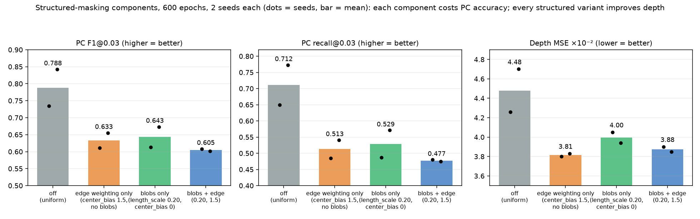
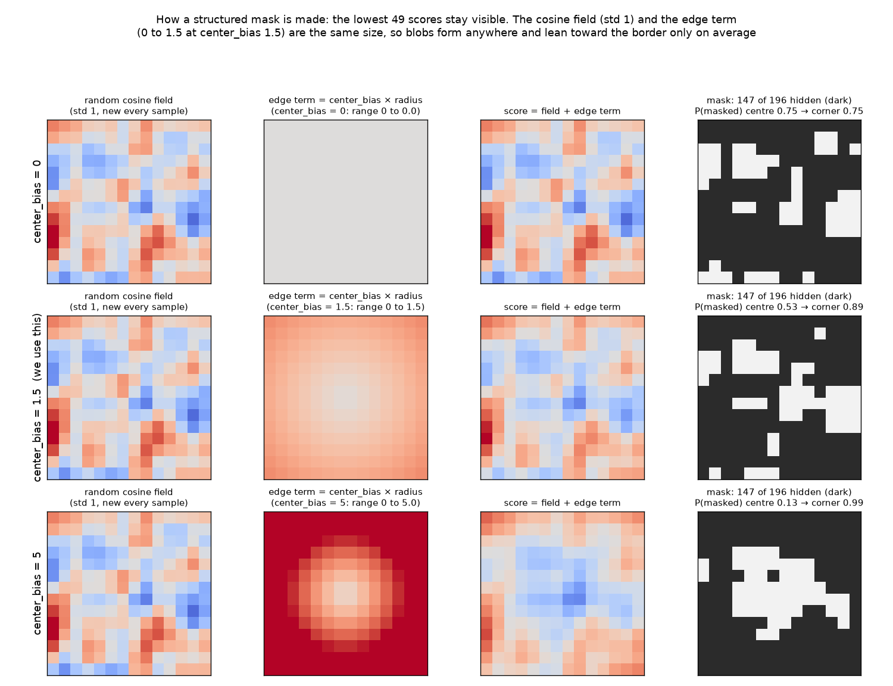
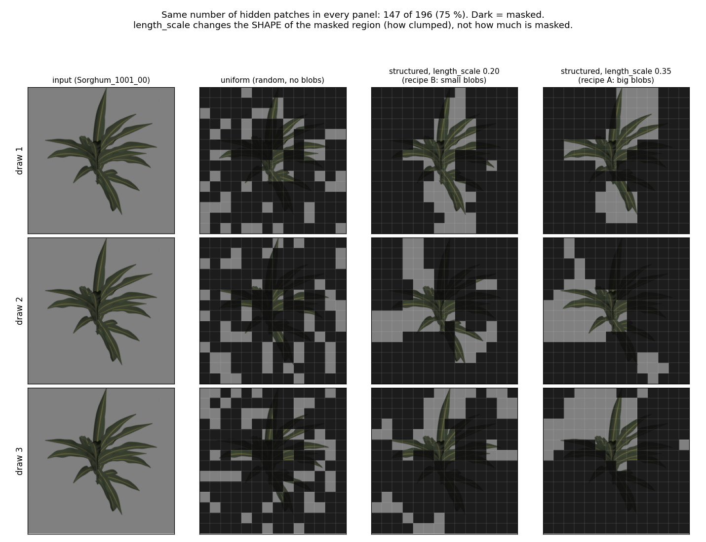
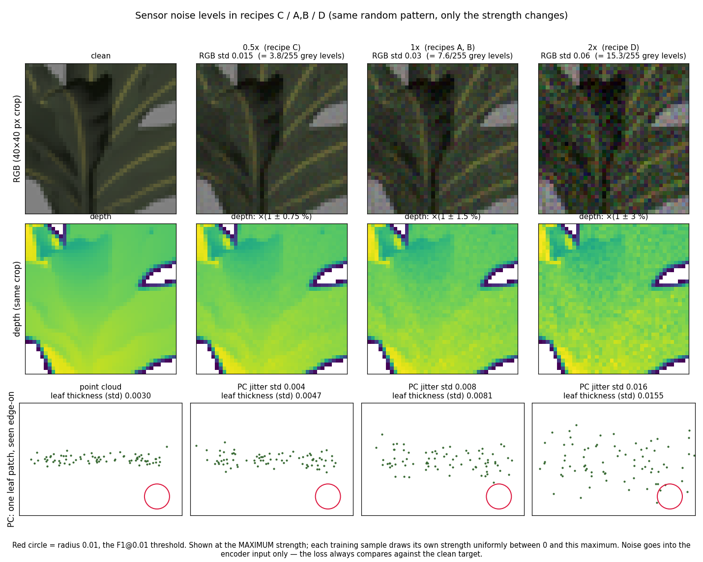
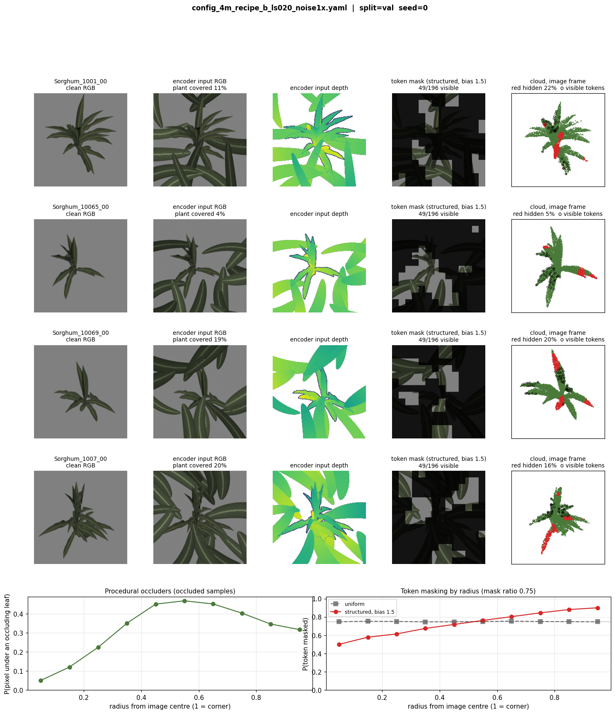

**Setup (all tables).** 4M base, 3 000 train plants (1 view / plant / epoch), global
batch 32, same input corruption in every run (procedural Bézier leaves + sensor noise).
Validation: fixed 225-view subset, **completely clean** (no leaves, no noise), uniform token
mask (no blobs), scored against the clean sample. **mean ± half-range over seeds** where 2 seeds.
Seed-to-seed noise floor (same config twice): F1@0.03 0.3 %, F1@0.01 1.7 %, Chamfer 0.6 %.
F1@$\tau$, recall, precision: fraction of points within $\tau$; Chamfer and MSE: lower is better.

# 1. Structured masking — 600 epochs, 2 seeds

| structured | blob size | edge bias | F1@0.03 | F1@0.01 | recall@0.03 | precision@0.03 | Chamfer $\times10^{-3}$ | Depth MSE $\times10^{-2}$ |
|---|---|---|---|---|---|---|---|---|
| off | – | – | **0.788 ± 0.054** | **0.291 ± 0.061** | **0.712 ± 0.062** | **0.904 ± 0.038** | **2.20 ± 0.39** | 4.48 ± 0.22 |
| on | 0.02 (no blobs) | 1.5 | 0.633 ± 0.022 | 0.195 ± 0.011 | 0.513 ± 0.028 | 0.849 ± 0.001 | 3.90 ± 0.32 | **3.82 ± 0.02** |
| on | 0.20 | 0 | 0.643 ± 0.030 | 0.189 ± 0.009 | 0.529 ± 0.042 | 0.845 ± 0.003 | 3.77 ± 0.45 | 4.00 ± 0.06 |
| on | 0.20 | 1.5 | 0.605 ± 0.003 | 0.176 ± 0.001 | 0.478 ± 0.003 | 0.848 ± 0.003 | 4.36 ± 0.01 | 3.88 ± 0.03 |

{ width=100% }

**How a structured mask is made.** Each patch gets a score = *random cosine field* +
`center_bias` $\times$ radius; the 49 lowest-scoring patches stay visible, the other
147 are hidden. The cosine field is a smooth random surface, redrawn every sample
(its smoothness sets the blob size, `length_scale`); the edge term tilts it toward
the border. The field has standard deviation 1 and the edge term spans 0–1.5 at
`center_bias` 1.5, so **neither dominates**: blobs still land anywhere, and the
border is favoured only on average. That is why the masks look mixed rather than
edge-only.

| `center_bias` | P(masked), centre | P(masked), corner | resulting mask |
|---|---|---|---|
| 0 | 0.75 | 0.75 | blobs anywhere |
| **1.5 (used)** | 0.53 | 0.89 | blobs anywhere, leaning to the border |
| 5 | 0.13 | 0.99 | a near-fixed border ring, centre visible |

{ width=92% }

The occluding leaves (section 6) are a separate mechanism acting on the *input
pixels and points*, not on the token mask. They are also not edge-only by design:
each leaf is rooted just outside the frame but grows 0.6–1.2 image units inward,
so leaf coverage is highest mid-way out (about 47 % of pixels at radius 0.5) and
about 5 % at the centre.

# 2. Blob size and sensor noise — 30k steps (320 epochs), 1 seed

| blob size | sensor noise | F1@0.03 | F1@0.01 | Chamfer $\times10^{-3}$ | RGB MSE | Depth MSE $\times10^{-2}$ |
|---|---|---|---|---|---|---|
| 0.35 | 1× | 0.583 | 0.158 | 4.70 | 0.674 | 3.35 |
| 0.20 | 1× | 0.586 | 0.157 | 4.64 | 0.665 | 3.36 |
| 0.20 | 0.5× | 0.582 | 0.154 | 4.72 | 0.672 | 3.22 |
| 0.20 | 2× | 0.582 | 0.150 | 4.68 | 0.661 | 3.22 |
| 0.20 | 1× (repeat, seed 1) | 0.584 | 0.154 | 4.67 | 0.677 | 3.00 |

Blob size = `length_scale` (0.20 about 10 %, 0.35 about 18 % of the frame width; 0.02 = no blobs).
Edge bias = `center_bias`, push toward the frame border (at 1.5: P(masked) 0.64 at the centre, 0.89 at the corners).
Sensor noise 1× = pixels ±0.03, depth ±1.5 %, points ±0.008. Mask ratio 75 % in every row.

{ width=85% }

*Training token masks on one image (illustration, not a validation result). Validation never uses
blobs: its token mask is always the uniform one (2nd column).*

{ width=85% }

\newpage

# 3. Point-cloud loss — 600 epochs, 1 seed (masking: 0.20 / 1.5)

| loss | setting | F1@0.03 | F1@0.01 | recall@0.03 | precision@0.03 | Chamfer $\times10^{-3}$ | Depth MSE $\times10^{-2}$ |
|---|---|---|---|---|---|---|---|
| QAL | $\tau$ = 0.01, $\alpha$ = 100 | **0.608** | **0.176** | 0.480 | **0.850** | 4.35 | 3.90 |
| Chamfer (squared) | weight 10 | 0.578 | 0.144 | 0.450 | 0.846 | 4.35 | **3.63** |
| Sinkhorn only | blur 0.02, 2 048 pts | 0.474 | 0.136 | **0.710** | 0.359 | 10.32 | 4.07 |

# 4. QAL $\tau$ and $\alpha$ — 30k steps (320 epochs), 1 seed

| loss | $\tau$ | $\alpha$ | F1@0.03 | F1@0.01 | recall@0.03 | precision@0.03 | Chamfer $\times10^{-3}$ |
|---|---|---|---|---|---|---|---|
| QAL | 0.005 | 100 | 0.582 | 0.154 | 0.460 | 0.822 | 4.70 |
| QAL | **0.01** | **100** | **0.584** | **0.154** | 0.465 | 0.818 | **4.67** |
| QAL | 0.02 | 100 | 0.585 | 0.139 | 0.469 | 0.813 | 4.74 |
| QAL | 0.01 | 30 | 0.576 | 0.147 | 0.453 | 0.824 | 4.71 |
| QAL | 0.01 | 300 | 0.580 | 0.163 | 0.461 | 0.818 | 4.66 |
| Chamfer (squared) | – | weight 3 | 0.550 | 0.126 | 0.428 | 0.820 | 4.72 |

# 5. Params encoding — 600 epochs, 2 seeds (masking: 0.20 / 1.5, QAL)

| params | F1@0.03 | F1@0.01 | recall@0.03 | Chamfer $\times10^{-3}$ |
|---|---|---|---|---|
| v1 (original) | 0.605 ± 0.003 | 0.176 ± 0.001 | 0.478 ± 0.003 | 4.36 ± 0.01 |
| v2 + camera pose / scale (spline weight 0.6) | **0.617 ± 0.002** | **0.220 ± 0.005** | 0.483 ± 0.000 | **4.28 ± 0.08** |

**What v1 got wrong, measured on the data, and what v2 changes:**

| v1 problem | v2 change |
|------------------------------------------|--------------------------|
| The params describe the plant in its **world frame**, but the target point cloud is in the **camera frame** (`*_nc_cam.ply` = worldToCamera $\times$ world). The camera pose that links the two (`camera_pose.json`) was never read, so the model had to guess the viewpoint from the images. | camera rotation given to the model as an always-visible token (the translation needs none: centring the cloud removes it) |
| Each point cloud is rescaled to unit radius, which erases plant size: corr(stem length, cloud height) is 0.68 before rescaling, 0.08 after. | the rescaling radius added to the same token |
| 5 of the 9 plant values (`panicle_*`) are constant in the data; angles wrap around at 360°. | constants dropped, angles as sin/cos, all values z-scored, leaf count added |
| z-scored targets are about 6$\times$ larger than v1's [0, 1] values, so at the same loss weight the param loss takes gradient from the point-cloud loss. | spline loss weight 5 $\to$ 0.6 |

**How we know the frames** — files in every sample folder, checked on plant Sorghum_7 (all 10 views):

| check | result |
|------------------------------|------------------------------------------|
| training target `Sorghum_7_nc_cam.ply` vs the world cloud `Sorghum_7_nc.ply` | worldToCamera (from `camera_pose.json`) $\times$ world cloud = target cloud, point by point, error 0 (72 261 points); without the transform they differ by up to 2.9–3.8 |
| which files change with the view | `_nc.ply` and `_spline.yml` (the params) are byte-identical in all 10 view folders; `_nc_cam.ply` and `camera_pose.json` differ in every view |
| params: `stem_direction` | [0.04, 1.00, -0.02] = world up (+y), the same in every view; the same stem in camera coordinates points 24–133° apart across the 10 views |
| params: leaf `Center Points` (3 648 points) | lie on the world cloud (median distance 0.004); median 1.7 from the camera cloud as stored |
| what the v1 loader reads | `*_nc_cam.ply` as target and input, the params YAML as is; `camera_pose.json` is never opened |

Result: F1@0.01 +25 % (0.176 $\to$ 0.220, seed spread $\leq$ 0.005), i.e. points are placed
more precisely. The four changes were made together, so this does not say how much
comes from the camera token alone. The params already helped in v1: replacing each
sample's own params with the validation mean made its Chamfer 7 % worse (same masks,
30k-step model).

\newpage

# 6. Input corruption (fixed in every run): procedural Bézier leaves

| `num_leaves` | `reach` | `width` | `bend` | `heading_jitter_deg` | `depth_quantile` | `min_pc_keep` |
|---|---|---|---|---|---|---|
| 9–16 | 0.6–1.2 | 0.09–0.18 | 0.25 | ±35° | 0–0.8 | 0.35 |

{ width=92% }

**Sensor noise** (added on top of the leaves, to the encoder input only — the loss
always compares against the clean target). Strength is drawn per sample and per
modality, uniformly between 0 and the maximum below.

| modality | noise | max at 1× | applied to |
|---|---|---|---|
| RGB | additive Gaussian per pixel and channel | ±0.03 (about ±8 of 255 grey levels) | every pixel |
| depth | multiplicative Gaussian | ±1.5 % of the depth | plant pixels only (background stays 0) |
| point cloud (**PC jitter**) | additive Gaussian on x, y and z of every point | ±0.008 of the unit-radius cloud (about 8 mm on a ~1 m plant) | every point |

**Why jitter the point cloud.**

- *Real 3D sensors are noisy.* The synthetic cloud is sampled from the mesh, so
  every point lies exactly on the surface; depth cameras, LiDAR and photogrammetry
  scatter points in front of and behind the surface, most of all on thin leaves.
  Jitter trains on the kind of cloud a real sensor returns.
- *No copying.* Without it, the visible point-cloud tokens already contain exact
  target points and the model can lower the loss by reproducing them. With noisy
  input and a clean target, it has to infer where the true surface is — for
  example that a leaf which looks like a thick layer in the input is a thin sheet.
- *No modality shortcut.* If RGB and depth were noisy but the cloud clean, the
  model could rely on the cloud alone; corrupting all three prevents that.

At 2× the jitter (about 16 mm) exceeds the F1@0.01 threshold (about 10 mm), so a
model must remove it to score. Within 0.5×–2× it made no measurable difference
(section 2), so it is best read as insurance for real sensor data rather than as a
performance lever.

**Which runs used the corruption** (leaves + sensor noise, `prob` 1.0 = every
training sample):

| runs | leaves | PC jitter max |
|---|---|---|
| all 600-epoch runs in sections 1, 3, 5 (including `maskoff`) and the main 10k model | on | 0.008 (1×) |
| 30k screening, section 2 rows 1, 2, 5 and section 4 | on | 0.008 (1×) |
| 30k screening, 0.5× / 2× rows | on | 0.004 / 0.016 |
| original configs (`config_4m.yaml`), and main-branch runs built on them | **off** | **none** |

Every comparison in this brief therefore holds the corruption fixed. Rows from
runs trained without it (e.g. the main-branch E1–E4 runs, if built on the original
config) differ in this respect and need a note when placed in the same table.
Validation is completely clean (no corruption); robustness to corruption is tested
separately, on the test split.
